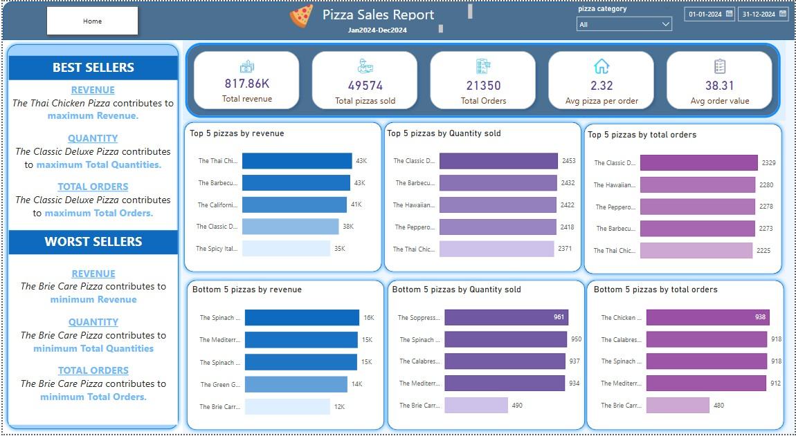
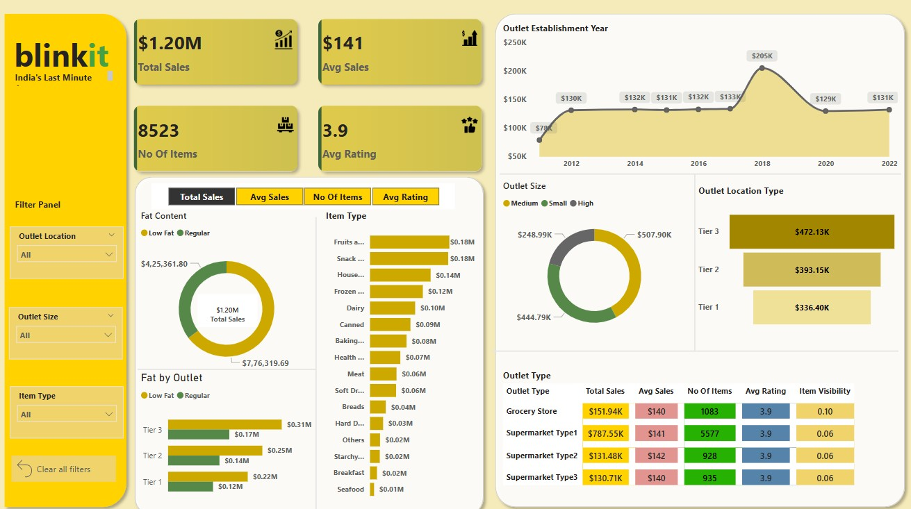
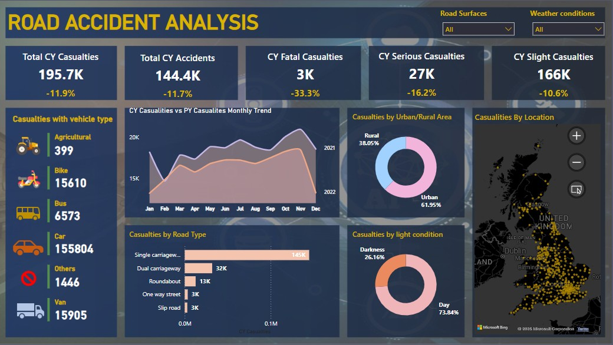
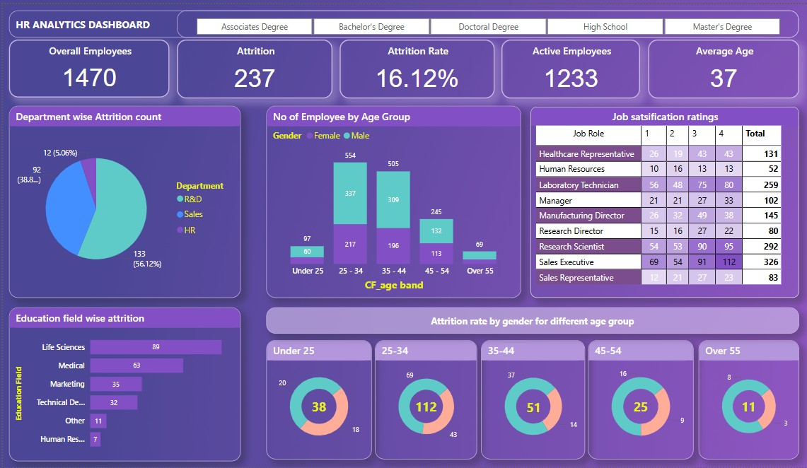

# 📊 Data Visualization Dashboards

Welcome to my portfolio — a collection of dashboard projects built using diverse tools like Power BI for data analysis and visualization to support decision-making.

---

## ✅ Project Workflow

For each project, the following key steps were performed:

1. **📌 Requirement Gathering**  
   - Understand the business problem and define KPIs.  
   - Identify stakeholders and reporting goals.

2. **📂 Raw Data Overview**  
   - Analyze data structure, formats, and key variables.  
   - Document source files and refresh frequency.

3. **🧹 Data Cleaning**  
   - Handle missing values, remove duplicates, and fix inconsistencies.  
   - Format columns and standardize data types.

4. **🔄 Data Processing & Transformation**  
   - Merge tables, filter necessary data, create calculated columns & measures.  
   - Use Power Query and DAX to enrich the dataset.

5. **📊 Data Modeling**  
   - Build a star schema with fact and dimension tables.  
   - Create relationships and optimize the model for performance.

6. **🎨 Background & Visual Design**  
   - Apply consistent layout, colors, and themes.  
   - Design with usability and storytelling in mind.

7. **📈 Data Visualization**  
   - Use charts, KPIs, slicers, cards, and maps to represent insights.  
   - Build interactive, drill-down-enabled dashboards.

8. **📋 Report & Insights**  
   - Add a summary insights page.  
   - Present actionable takeaways from the data.

---

## 📦 Project Inclusions

- 📁 Raw datasets  
- 📊 `.pbix` Power BI files  
- 📷 Dashboard screenshots  
- 📘 Insights and documentation  

---

## 🚀 Featured Dashboards

---

### 🍕 [Pizzashop Sales Analysis](./pizza_sales_analysis/README.md)

Monitor pizza sales trends, top-performing items, customer preferences, and revenue by category.

**Screenshots:**

  

---

### 🛒 [Blinkit Sales Analysis](./blinkit_analysis/README.md)

Track Blinkit's order volume, revenue, delivery times, and item performance.

**Screenshots:**

  

---
### 👥 [Road Accident Analysis](./road_accident_analysis/README.md)

Analyze Various Conditions Road Accident data (uk 2021-2022).

**Screenshots:**

  

---

### 👥 [HR Analysis](./hr_analysis/README.md)

Analyze employee attrition, satisfaction, and job roles across departments.

**Screenshots:**

  

---

## 📌 How to Use

1. Clone or download this repo.  
2. Open any `.pbix` file in Power BI Desktop.  
3. Explore the visuals, data model, and insights.

---

## 📜 License

This repository is under the MIT License. See [LICENSE](./LICENSE) for details.
