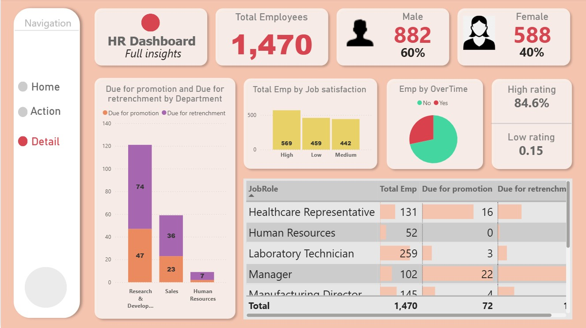

# HR Dashboard Analysis

A dashboard designed to analyze employee data across various dimensions including department, job role, and demographics.

## 🔍 Overview
This interactive dashboard provides a comprehensive view of HR metrics. It helps stakeholders and analysts:

- 📊 Track total employees, gender distribution, and job satisfaction
- 🌍 Analyze employees due for promotion or retrenchment by department
- 📦 Explore performance by job role and years of service
- 📈 Visualize trends in overtime and ratings

## 📊 Tools Used
- Power BI – Data modeling and dashboard creation
- Excel – Raw data processing and structure

## 📁 Folder Structure
hr_dashboard_analysis/
│
├── Dataset/               # Contains source data files
├── Images/                # Screenshots of the dashboard
├── DPowerBI_Report/        # Dashboard file
├── README.md              # Project documentation
└── LICENSE                # License information

## 📷 Dashboard Preview

## 📈 Key Insights
- Total Employees: 1,470
- Gender Distribution: 60% Male (882), 40% Female (588)
- Employees by Job Satisfaction: 569 High, 459 Low, 442 Medium
- Employees by Overtime: 117 Yes (8.0%), 1,353 No (92.0%)
- Due for Promotion: 72 (4.90%)
- Due for Retrenchment: 74 (Research & Development), 36 (Sales), 47 (Human Resources)
- Years of Service: 202 (10 years), 125 (6 years), 103 (8 years)
- High Rating: 84.6%
- Distance from Office: 229 Very Close (15.58%), 301 Close (20.48%), 940 Very Far (63.95%)

## 📎 How to Use
1. Clone or download this project.
2. Open the dashboard file from the `Dashboard_File/` folder using Power BI.
3. Use the navigation options to explore different views.
4. Interact with charts for detailed insights.

## 🧾 Data Source
The dataset includes details such as employee count, gender, job role, department, years of service, promotion status, and ratings.

## 📜 License
This project is licensed under the MIT License. See the `LICENSE` file for details.