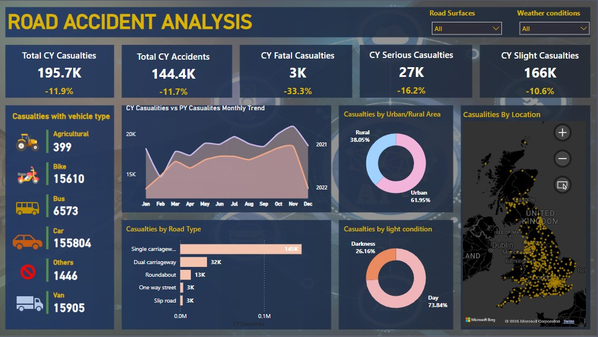

## 🚗 Road Accident Analysis Dashboard (Power BI)
A Power BI dashboard designed to analyze road accident data across multiple dimensions including vehicle type, accident severity, road type, and conditions.

## 🔍 Overview
This interactive dashboard provides a comprehensive view of road accidents and casualties across the UK. It helps stakeholders and authorities:

🚧 Track total, serious, fatal, and slight casualties

🚗 Analyze accidents by vehicle type, road type, and urban/rural settings

🌤 Explore effects of weather, road surface, and light conditions

📍 Visualize accident locations on a map

## 📊 Tools Used
Power BI – Data modeling and dashboard creation

Excel – Raw data processing and structure

Map Visuals – Used to geocode and visualize location data

## 📁 Folder Structure
Road_Accident_Analysis/
│
├── Dataset/               # Contains source Excel or CSV files
├── Images/                # Screenshots of the dashboard
├── PowerBI_Report/        # Power BI (.pbix) file
├── README.md              # Project documentation
└── LICENSE                # License information
## 📷 Dashboard Preview

## 📈 Key Insights
Total Casualties (CY): 195.7K (↓11.9%)

Total Accidents (CY): 144.4K (↓11.7%)

Fatalities (CY): 3K (↓33.3%)

Serious Casualties (CY): 27K

Urban Areas: 61.95% of accidents

Most Accidents by Road Type: Single Carriageways (~145K)

Light Condition Impact: 73.84% of accidents occur during the day

📎 How to Use
Clone or download this project.

Open the .pbix file from the PowerBI_Report/ folder using Power BI Desktop.

Use the filters for road surface and weather to customize your view.

Explore map and visual insights interactively.

🧾 Data Source
The dataset includes details such as vehicle type, accident severity, road type, time, light conditions, and geographical location.

📜 License
This project is licensed under the MIT License. See the LICENSE file for details.

