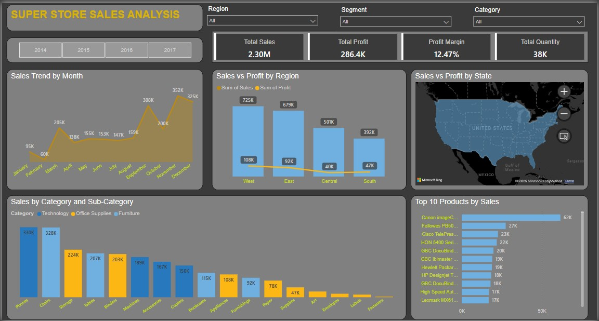

# Super Store Sales Analysis Dashboard (Power BI)

A Power BI dashboard designed to analyze sales data across multiple dimensions including region, segment, category, and product performance.

## 🔍 Overview
This interactive dashboard provides a comprehensive view of sales and profit metrics for Super Store. It helps stakeholders and analysts:

- 📊 Track total sales, profit, profit margin, and quantity sold
- 🌍 Analyze sales and profit by region, state, and segment
- 📦 Explore performance by category and top-selling products
- 📈 Visualize trends over time

## 📊 Tools Used
- Power BI – Data modeling and dashboard creation
- Excel – Raw data processing and structure
- Map Visuals – Used to geocode and visualize state-level data

## 📁 Folder Structure
Super_Store_Sales_Analysis/
│
├── Dataset/               # Contains source Excel or CSV files
├── Images/                # Screenshots of the dashboard (e.g., home.jpg)
├── PowerBI_Report/        # Power BI (.pbix) file
├── README.md              # Project documentation
└── LICENSE                # License information

## 📷 Dashboard Preview

## 📈 Key Insights
- Total Sales: 2.3M
- Total Profit: 286.4K
- Profit Margin: 12.47%
- Total Quantity: 38K
- Sales Trend: Steady increase with a peak of 352K
- Top Region: East (727K sales)
- Top Category: Technology (330K sales)
- Top Product: Canon ImageCLASS (62K sales)

## 📎 How to Use
1. Clone or download this project.
2. Open the `.pbix` file from the `PowerBI_Report/` folder using Power BI Desktop.
3. Use the filters for region, segment, and category to customize your view.
4. Explore charts and map insights interactively.

## 🧾 Data Source
The dataset includes details such as sales, profit, quantity, region, segment, category, and product-level data.

## 📜 License
This project is licensed under the MIT License. See the `LICENSE` file for details.