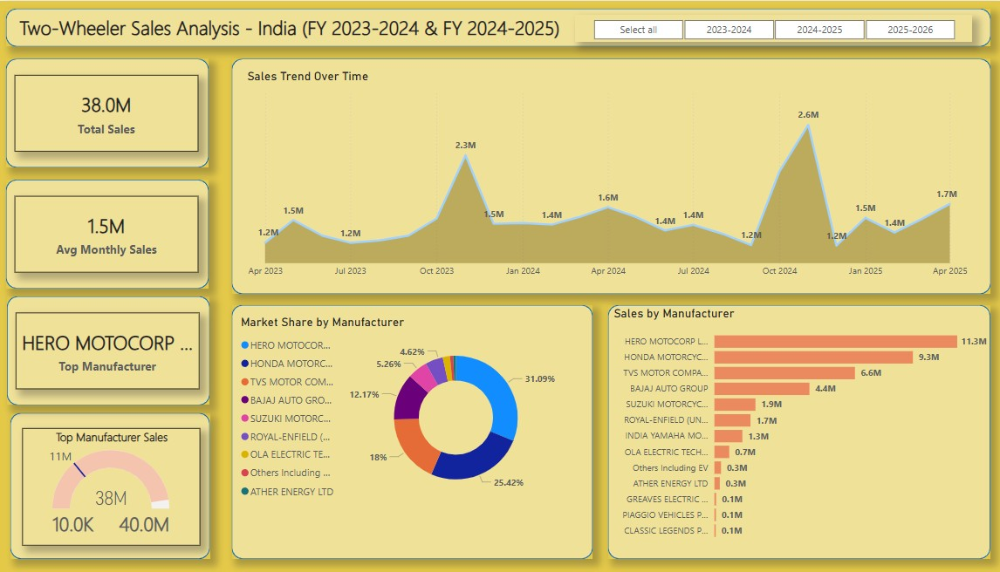

# 🚲 Two-Wheeler Sales Analysis Dashboard (Power BI)

A Power BI dashboard designed to analyze two-wheeler sales data in India across FY 2023-2024 and FY 2024-2025, focusing on manufacturer performance, sales trends, and market share.

## 🚲 🔍 Overview
This interactive dashboard provides a comprehensive view of two-wheeler sales metrics in India. It enables stakeholders and analysts to:

- 📊 Track total sales and average monthly sales
- 📈 Analyze sales trends over time
- 🌍 Explore market share and sales by manufacturer
- 📊 Identify top-performing manufacturers

## 🚲 📊 Tools Used
- Power BI – Data modeling and dashboard creation
- Excel/CSV – Raw data processing and structure

## 🚲 📁 Folder Structure
Two_Wheeler_Sales_Analysis/
│
├── Dataset/               # Contains source CSV files (e.g., motorcycle_sales.csv)
├── Images/                # Screenshots of the dashboard (e.g., home.jpg)
├── PowerBI_Report/        # Power BI (.pbix) file
├── README.md              # Project documentation
└── LICENSE                # License information

## 🚲 📷 Dashboard Preview

## 🚲 📈 Key Insights
- Total Sales: 38.0M
- Average Monthly Sales: 1.5M
- Sales Trend: Peaks at 2.6M (Oct 2024) and 2.3M (Oct 2023), with a low of 1.2M (Jun 2023)
- Top Manufacturer: Hero MotoCorp Ltd. (11.3M sales)
- Top Manufacturer Sales: 11M
- Market Share by Manufacturer: Hero MotoCorp Ltd. (31.09%), Honda Motorcycle (25.42%), TVS Motor Company (12.17%), others varying from 4.62% to 18%

## 🚲 📎 How to Use
1. Clone or download this project.
2. Open the `.pbix` file from the `PowerBI_Report/` folder using Power BI Desktop.
3. Use the filters for FY (e.g., 2023-2024, 2024-2025) to customize your view.
4. Explore charts and insights interactively, including sales trends, market share, and manufacturer performance.

## 🚲 🧾 Data Source
The dataset includes sales data for manufacturers such as Hero MotoCorp Ltd., Honda Motorcycle, TVS Motor Company, Bajaj Auto Group, and others, covering April 2023 to April 2025.

## 🚲 📜 License
This project is licensed under the MIT License. See the `LICENSE` file for details.